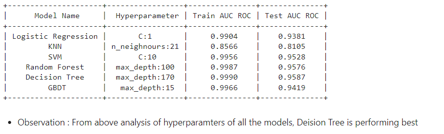

# Sentiment Analysis of google play store reviews using classical machine learning models

Dataset: Scrapped data from google-play-scraper. Scrapped data from 14 apps named below. Each review has rating from 1 to 5.


| Rating  | Total Data points |
| ------------- | ------------- |
| 1  | 2904  |
| 2  | 2684  |
| 3  | 5363  |
| 4  | 2922  |
| 5  | 3000  |

Dropping reviews which has rating of 3 as it can be ambiguous. Later joined rating 1 and 2 as negative reviews and rating 4 and 5 as positive reviews.

Now total Dataset belonging to class 0 and 1

Positive Data (class 1) = 5922 and Negative Data (class 0) = 5588

#### Input :
    Reviews text and Reviews Score.

#### Output :
    ROC AUC of various machine learning models.

## Requirements

- sklearn libraries
- Both ipynb contains all the necessary imports kindly check them and install required libraries.

## Run Locally

Clone the project

```bash
  git clone https://link-to-project
```

Go to the project directory

```bash
  cd my-project
```

Install dependencies

```bash
  install above packages
```

Run main file

```bash
  Run each file in jupyter notebook
```

## Conclusion




## Authors

- [@bhawana](https://www.github.com/bhawna94110)

  

  
## 🔗 Links
[](https://bhawana.netlify.com/)

[](https://www.linkedin.com/in/kbhawna/)

